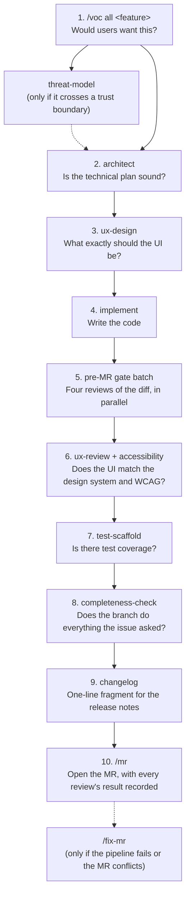

**The big picture:** Every change runs through a chain of reviews, but **the chain is
sized to the change**. A typo fix opens an MR and that's it; a new full-stack feature gets
user, design, security, and completeness reviews.

**Why it matters:** Too little review ships bugs; too much review ships nothing. Matching
review to risk is what keeps an AI-assisted project both safe and fast.

**How it works:**
- The *Fast paths by change class* table in `CLAUDE.md` is the authority. Find the row
  that matches your change; run only the gates it names.
- With [`global-claude-md.example`](/getting-started/start-a-project/#7-turn-on-the-agent-workflow)
  installed, Claude follows that table on its own. Without it, you ask for each review.
- When a change fits two rows, take both. When unsure, take the heavier row and say why.

## Pick your path

| Your change | Reviews, in order |
|---|---|
| **Chore, CI config, or lint-only** | `/mr` |
| **Dependency bump** | `dependency` → `changelog` → `/mr` |
| **Docs only** | `docs` (if it's a new page) → `completeness-check` → `/mr` |
| **Bug fix, cause known** | `regression-check` → `test-scaffold` (if untested) → `completeness-check` → `changelog` → `/mr` |
| **Backend-only feature** | `architect` → pre-MR gate batch → `test-scaffold` → `completeness-check` → `changelog` → `/mr` |
| **New user-visible feature (full stack)** | the full chain below |

`CLAUDE.md` has a few more rows (schema-only changes, wiring a form onto an existing
screen, frontend-only, and new trust-boundary subsystems). Check it for your exact case.

## The full chain, and why each step is there

1. **`/voc`** — your personas react to the idea. **Why:** the most expensive bug is a
   feature nobody needed. (A simulation, not user research.)
2. **`architect`** — debt, coupling, migration risk, reversibility. **Why:** changing a
   plan costs minutes; changing merged code costs days. Don't start coding until its
   blocking questions are answered.
3. **`ux-design`** — layout, components, every state. **Why:** if the implementer has to
   make design decisions, every screen invents its own patterns.
4. **Implement.** Tests and docs go in the **same commit** as the code.
5. **Pre-MR gate batch** — `regression-check`, `security-review`, `rbac-check`,
   `perf-check`, each only if the diff touches its area. **Why in parallel:** they're
   independent reads of the same diff, and running them one after another was the biggest
   avoidable source of delay.
6. **`ux-review` + `accessibility`** — **Why:** visual drift and keyboard traps are
   invisible in a code diff.
7. **`test-scaffold`** — **Why:** new code without tests is a future regression. Each new
   test must be seen failing on the unfixed code first.
   Coverage alone doesn't prove the tests are good when an AI wrote both sides; see
   [Testing AI-written code](/guides/testing-ai-written-code/).
8. **`completeness-check`** — a fresh agent that didn't write the branch checks it
   against the issue. **Why:** most gaps that reach `main` break rules already written
   down; what's missing is someone other than the author checking before the push.
9. **`changelog`** — **Why:** CI blocks the MR without it, and the release notes are
   built from these lines.
10. **`/mr`** — **Why:** a consistent MR description is the permanent record of what ran
    and what it found.

Each agent is described in full on the [Agents](/reference/agents/) page, and each skill on
the [Skills](/reference/commands/) page.

## Go deeper

See [Flows](/guides/flows/) for the whole lifecycle as one diagram per flow.

### Completeness-check: one more pass, at most

After `completeness-check` reports, the author fixes every finding **in a new commit**
(never an amend, so the fix stays separable). Then at most one more pass runs:

| Round 1 found… | Next |
|---|---|
| a structural problem (another instance of the same bug, or something else the change broke) **or** four or more gaps | **Round 2**: a full audit by a fresh Opus agent that isn't shown round 1's findings |
| any other blocker, **or** a fix changed executable code | **Fix-diff re-check**: audit only the fix commits |
| neither | nothing more |

Never a loop. If the last pass still finds a blocker, the problem is the branch, not the
review — stop and decide with a human: split it, rethink it, or ship with the risk stated.

### `/review` vs. the specialist agents

| Review | Looks for | Use on |
|---|---|---|
| `/review` | Code quality, patterns, consistency, naming | Any change — the generalist pass |
| `security-review` | OWASP Top 10, auth, injection | Endpoints, auth, user input |
| `rbac-check` | Login required, per-object access, roles | Endpoints and permission rules |
| `ux-review` | Design-system compliance | UI changes |
| `accessibility` | WCAG 2.1 AA | UI changes |
| `regression-check` | Stale mocks, broken suites, permission drift | Every source change |
| `completeness-check` | Issue fully delivered, whole bug class, tests that can fail, true docs | Every source or docs branch, before push |

### Safety hooks: guardrails that don't depend on memory

**Why they matter:** an instruction in `CLAUDE.md` is followed most of the time. A hook
runs **every** time. Use hooks for the few things that must never slip.

**Before an edit** — `.claude/hooks/pre-tool-safety.sh` (`PreToolUse`, on `Edit|Write`):

| File | Action | Why |
|---|---|---|
| Lock files (`package-lock.json`, `yarn.lock`, `uv.lock`, `go.sum`, …) | **Block** | The package manager must regenerate them |
| Existing migrations (`migrations/<number>…`) | **Block** | Editing a migration that already ran corrupts real databases; write a new one |
| CI config (`.gitlab-ci.yml`, `ci/*.yml`, `.github/workflows/`) | Warn | Affects every branch — verify before pushing |
| Env files (`.env`, `.env.local`, `.env.production`) | Warn | May hold secrets — never commit them |

**After an edit** — `.claude/hooks/post-edit-checks.sh` (`PostToolUse`) prints a
reminder:

| File | Reminder |
|---|---|
| `models.py`, `schema.prisma`, `*.sql` | Verify migration safety |
| `views.py`, `routes/`, `handlers/`, `controllers/` | Run `rbac-check` and `security-review` as a parallel batch |
| `permissions.py`, `auth.*`, middleware | Run `rbac-check` and `security-review` |
| UI components (`.tsx`, `.jsx`, `.vue`, `.svelte` under components/pages/…) | `/voc` before design; `ux-review` and `accessibility` after |
| Production source (not tests) | Update its test in the same commit |
| TypeScript source | Run `make typecheck` before committing |
| Settings and config files | If you renamed a key, grep for the old name everywhere |

**Before opening an MR** — `.claude/hooks/pre-mr-security-gate.sh` (`PreToolUse`, on
`Bash`) stops a `glab mr create` when source or sensitive paths changed and tells Claude
to run the access-control and security reviews first. Once they've run, Claude retries the
same command prefixed with `SKIP_SECURITY_GATE=1` — the hook can't tell "reviews ran" from
"reviews never ran" by looking at the diff, so the prefix is the recorded, visible way
through. It hooks the actual command rather than the `/mr` prompt, so it also fires when an
agent opens the MR directly.

Adapt the patterns to your stack. A hook blocks with exit code 2 and allows with 0.

### The duplicate-work gate

`scripts/check-issue-collision.sh` runs first on every `git push` (via
`make pre-push-checks`).

| Situation | Result |
|---|---|
| The branch's issue already has an open MR from a **different** branch | **Blocked** — override with `ALLOW_DUP_MR=1` for deliberate stacked work |
| The issue carries the WIP label but has no MR yet, and the check-out comment `wt new` left does not name your branch (a hand-applied label, or another session) | Warning |
| No issue number in the branch, or the issue is unclaimed | Pass |

**Why at push time:** a branch can be created many ways (`wt new`, a plain
`git checkout -b`, another session), but every one passes through `git push`. It reads
**every** page of open MRs, and if it can't read them at all (offline, not logged in), it
says so out loud instead of passing quietly. Works with `glab` or `gh`.
