**The big picture:** Every skill and gate has its own page. This page shows the *order*
they run in across a project's life, one small top-to-bottom diagram per flow.

**Why it matters:** The ordering is the harness. Seeing it at a glance tells you which
step comes next, and which step is a one-time gate rather than a loop.

**How to read it:** Click any command or agent in a diagram to open its entry in the
[command](/reference/commands/) or [agent](/reference/agents/) reference. Each diagram has a
plain-text list under it, because diagrams need JavaScript to draw.

## 1. Creation flows

### Project creation

**Start here:** Turn the template into a project, then load your spec into the tracker.

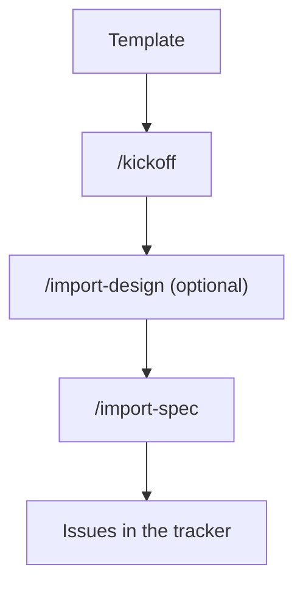

1. Copy the template ([Start a project](/getting-started/start-a-project/)).
2. `/kickoff` asks for the name, personas, and first milestone.
3. `/import-design` (optional) turns a design guide into `frontend/CLAUDE.md`.
4. `/import-spec` turns your spec into tracker issues.

### Issue creation

**Search first, file second, label only by asking.** An issue in a dated milestone
carries exactly one `release::` label, and the user picks it every time.

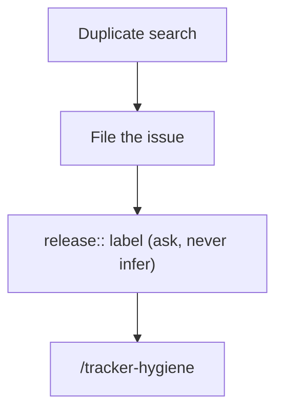

1. `glab issue list --search "<key terms>" --all` for duplicates and partial overlaps.
2. File the issue.
3. If it lands in a dated milestone, ask which `release::` label applies.
4. `/tracker-hygiene` sweeps later for label, duplicate, and staleness drift.

More in [Issues and the tracker](/guides/issues-and-the-tracker/).

## 2. New milestone flow

**Plan once, before any code.** `/dotplanning` runs once per milestone, not once per
feature.

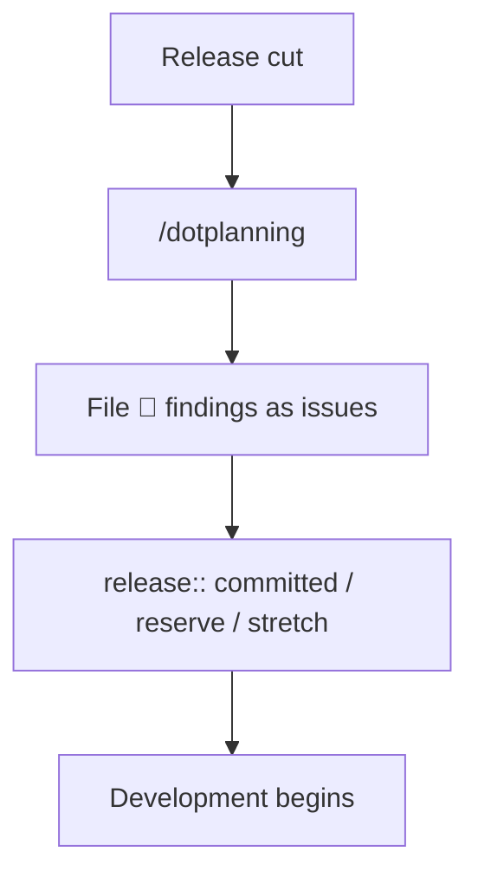

1. A release is cut.
2. `/dotplanning` resolves the scope, builds the feature-to-asset map, flags missing
   assets and open questions, sequences workstreams, and writes an HTML report.
3. File every 🔴 finding as an issue.
4. Label each issue `release::committed`, `release::reserve`, or `release::stretch`.
5. Development begins.

## 3. Working in the early stage (pre-1.0, simple variant)

**One wave, one worktree per issue.** `/batch` fans a wave of issues out to delegated
agents; `/mass-merge` lands the green MRs.

Delegate and build:

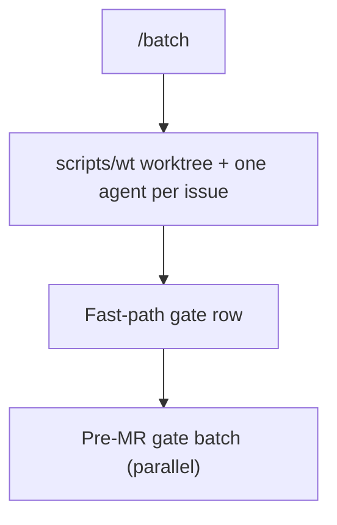

Gate, open, and fix:

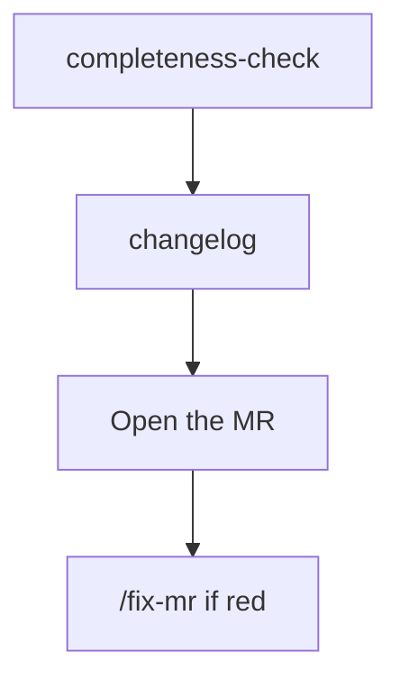

Land the wave:

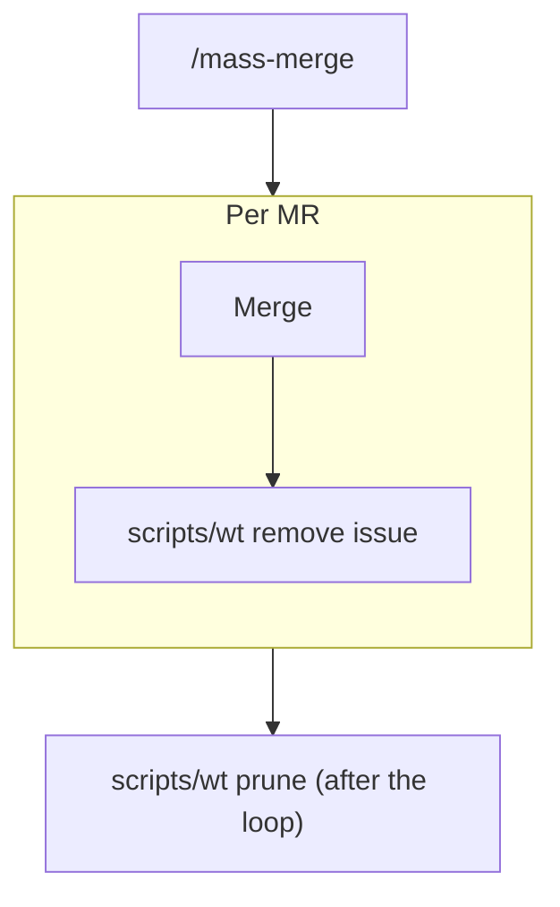

1. `/batch` creates one `scripts/wt` worktree and one delegated agent per issue.
2. Each agent runs only the gates in its change class's fast-path row.
3. The pre-MR gates (`regression-check`, `security-review`, `rbac-check`, `perf-check`)
   run as one parallel batch.
4. `completeness-check` and `changelog` run, then the MR opens.
5. `/fix-mr` gets a red MR to green.
6. `/mass-merge` lands the green wave. It runs `scripts/wt remove <issue>` **after each
   MR merges**, so a run that stops partway still cleans up what it landed.
7. A final `scripts/wt prune` catches anything the per-MR removals missed.

More in [Parallel work](/guides/parallel-work/) and the
[development workflow](/guides/development-workflow/).

## 4. Using `/batch` for a single issue

**Use `/batch` even for a wave of one.** It picks the model for the job.

**Why it matters:**
- **Sonnet by default.** In measured waves, Opus subagents were most of the bill, and
  most issues do not need it.
- **Opus only on a named criterion:** the root cause is unknown, the fix spans three or
  more packages, it changes core domain semantics, or it needs a design judgment the
  issue does not settle.
- **Read-only gates always run on Sonnet.** `/batch` passes `model: "sonnet"` when it spawns
  them, which overrides the Opus default in `regression-check` and `security-review`.
  `completeness-check` is the one exception: it escalates on the same criteria.
- **By hand, you get whatever the main session runs on,** often Opus, and every gate
  shares that one expensive context.

Through `/batch`:

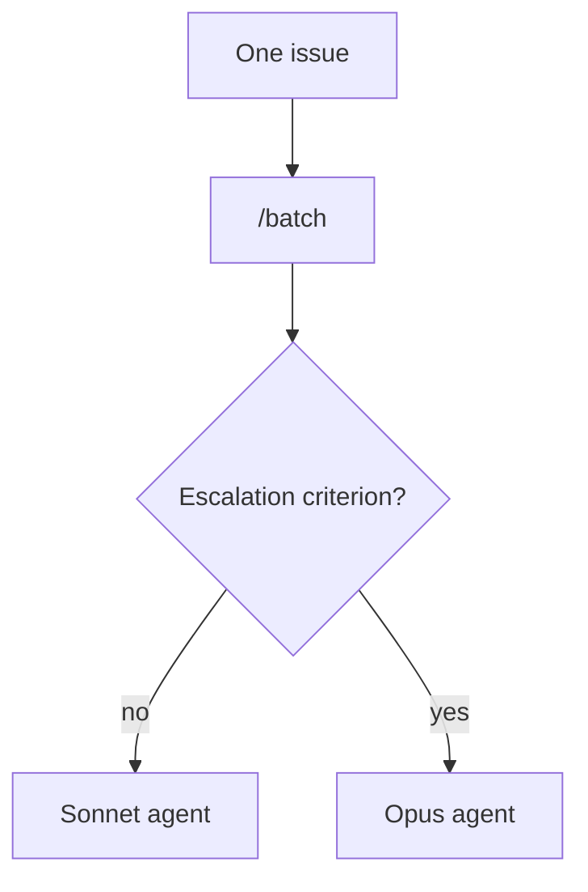

By hand:

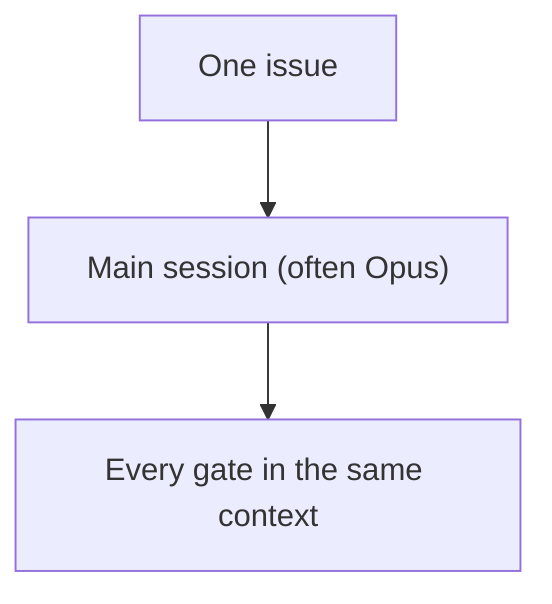

See [`/batch`](/reference/commands/) for the full model-choice rules.

## 5. Flows leading up to `/release`

**Audit once, cut, tag by hand, then close the loop.** Each step below is a one-time
gate, not a loop.

Before the cut:

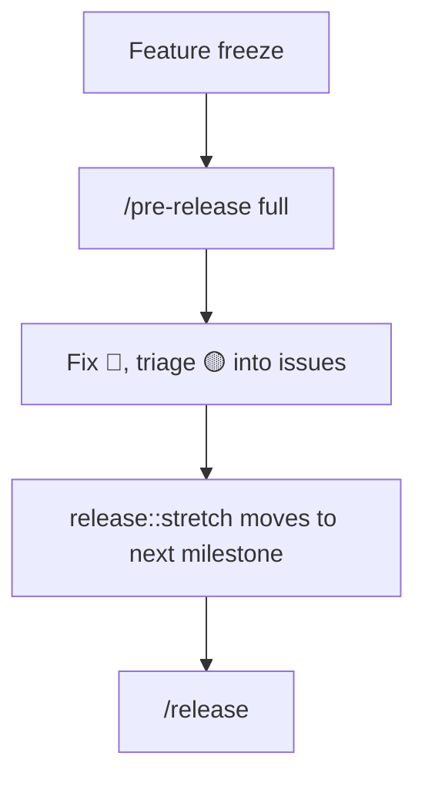

After the cut:

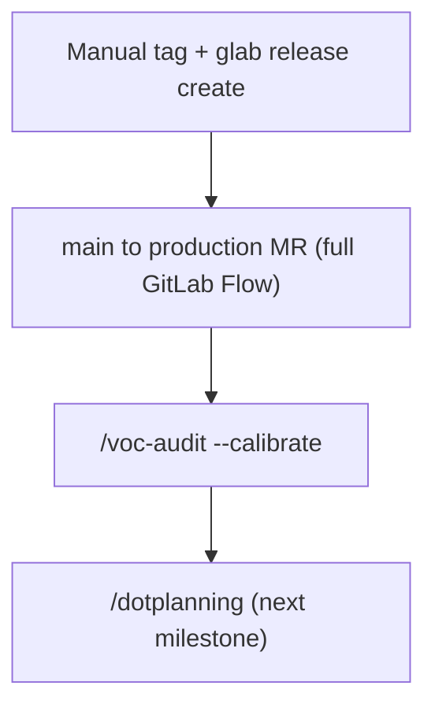

1. At feature freeze, run `/pre-release full` once.
2. Fix 🔴 findings; triage 🟡 into milestone issues.
3. Re-run only if the fixes were substantial.
4. `release::stretch` issues move to the next milestone without discussion.
5. `/release` cuts the release branch and MR.
6. Tag and run `glab release create` by hand.
7. On the full variant, open the `main` to `production` MR.
8. Once real users report, run `/voc-audit --calibrate`.
9. Run `/dotplanning` for the next milestone. That closes the loop back to
   [flow 2](#2-new-milestone-flow).

More in [Release workflow](/guides/release-workflow/).

## 6. Feature design sequence

**Design before code, in this order.** `threat-model` runs only when the feature crosses
a trust boundary.

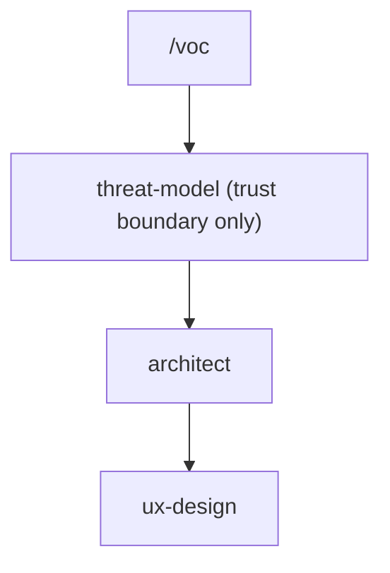

After design:

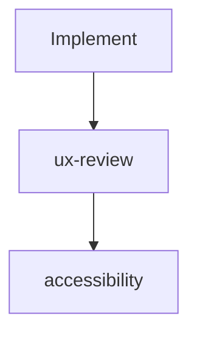

1. `/voc` surfaces adoption blockers before design.
2. `threat-model`, only if the feature crosses a trust boundary.
3. `architect`, given the VoC and threat-model output.
4. `ux-design`, given the architect review.
5. Implement.
6. `ux-review` and `accessibility` check the result.

## 7. Anatomy of a command

**Each command is a box; what it runs sits inside.** One small diagram per command.

### `/batch`

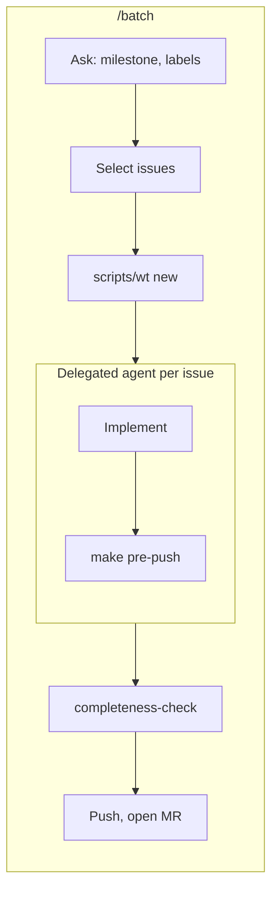

1. Ask which milestone and labels, then select independent issues.
2. Create one `scripts/wt` worktree per issue.
3. Each delegated agent implements and runs `make pre-push`, then stops.
4. `completeness-check` audits, then the branch is pushed and the MR opened.

### `/mass-merge`

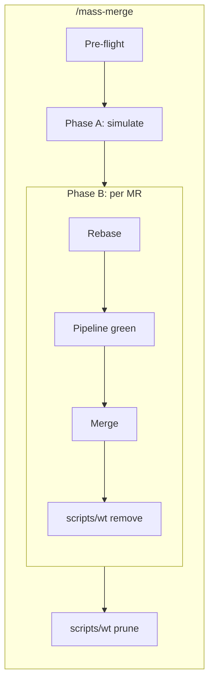

1. Pre-flight, then Phase A simulates the merge train.
2. Phase B, per MR: rebase, wait for a green pipeline, merge, then `scripts/wt remove`.
3. After the loop, `scripts/wt prune` catches anything missed.

### `/release`

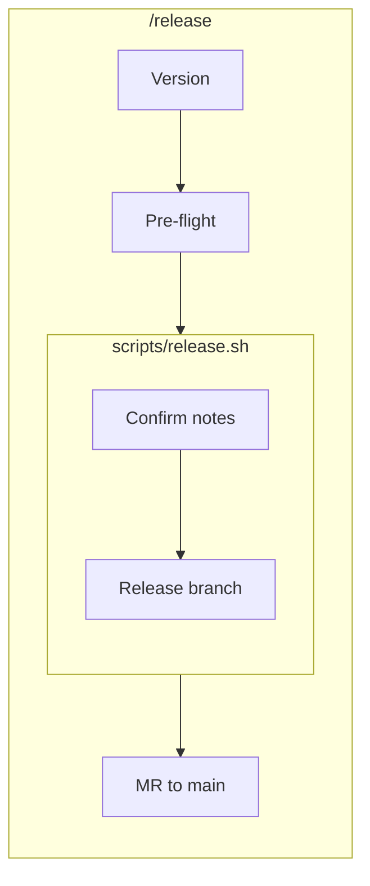

1. Confirm the version, then run the pre-flight checks.
2. `scripts/release.sh` shows the notes for your approval, then creates the release branch.
3. Open the MR to `main`.

### `/dotplanning`

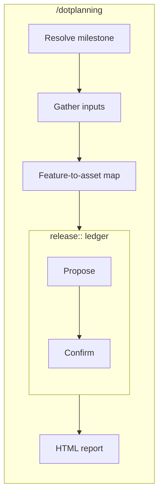

1. Resolve the milestone and gather inputs.
2. Build the feature-to-asset map.
3. Propose and confirm the `release::` ledger.
4. Emit the HTML report.

### `/mr`

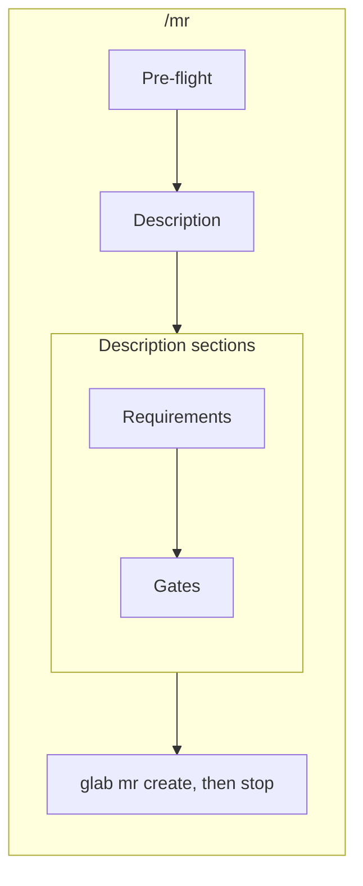

1. Pre-flight checks, then write the description.
2. The description carries Requirements and Gates sections.
3. `glab mr create`, then stop. Never merge.

Mermaid draws `click` links only at the "loose" security level, which this site enables because every diagram is authored in this repository. Command links go to the commands page rather than a heading anchor, so renaming a heading cannot break them.

Read the real steps in each skill's `SKILL.md` under `.claude/skills/`; these diagrams
show the shape, not every rule.
